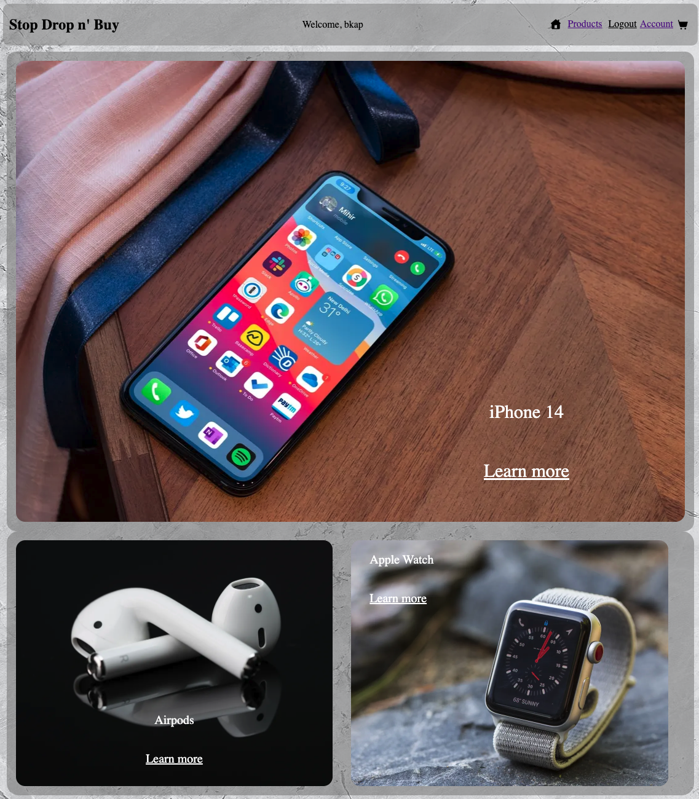
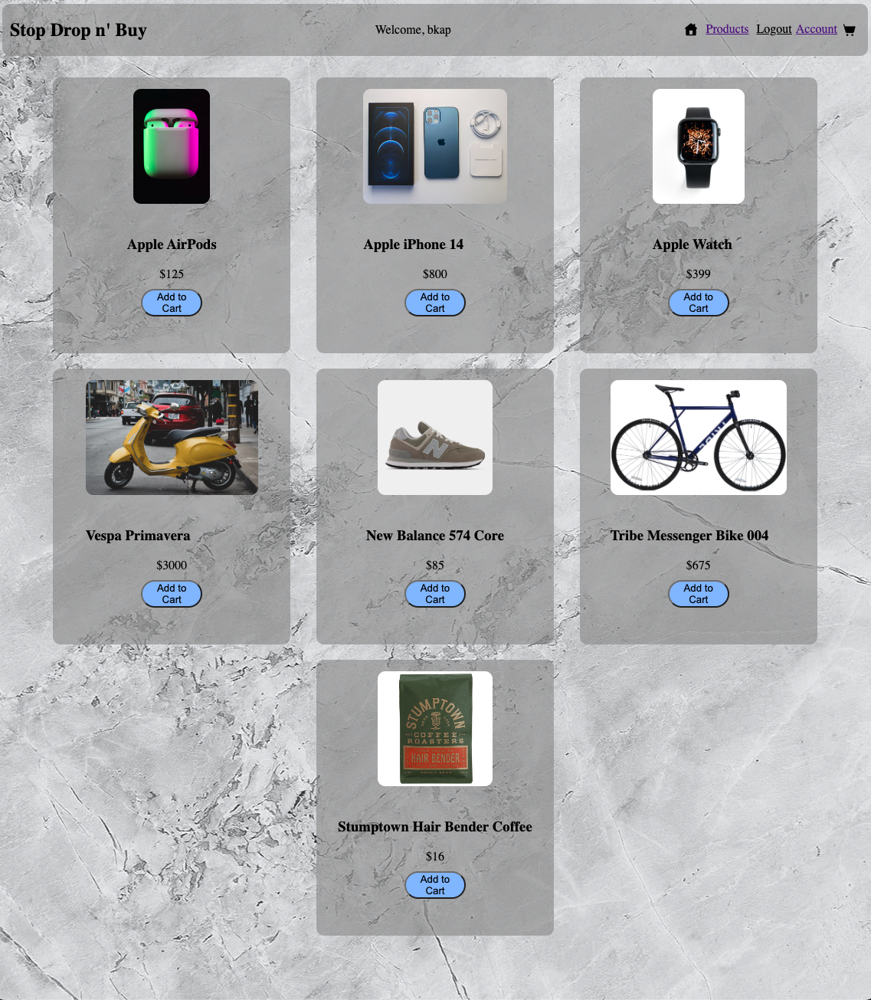
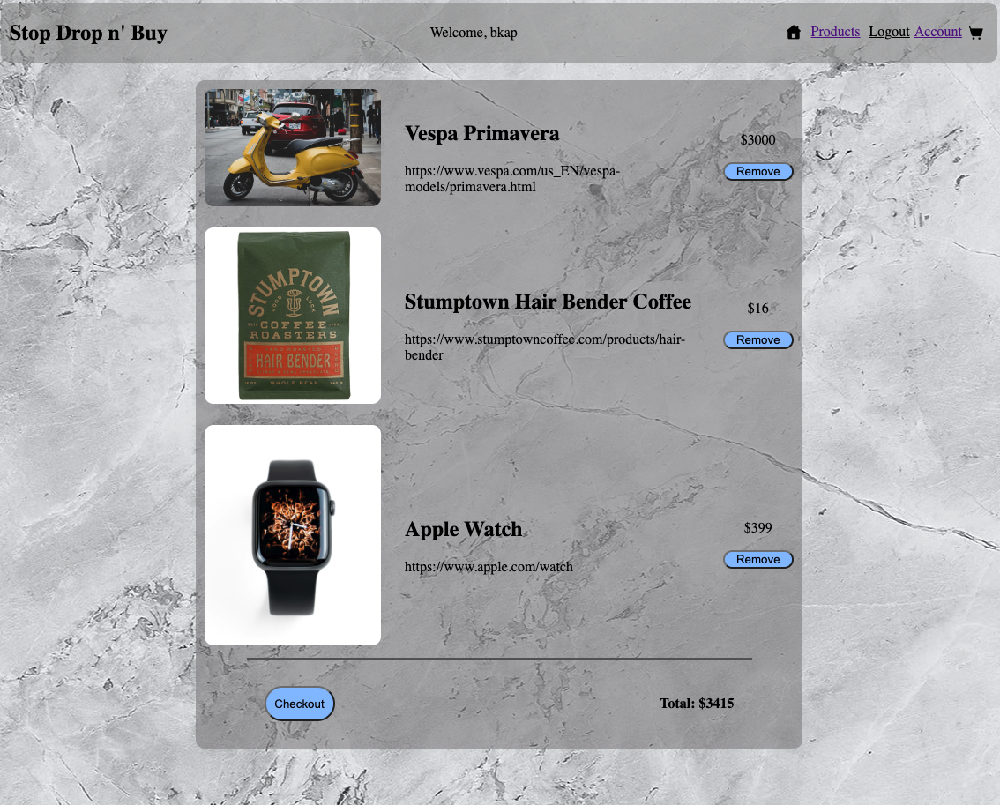

# Stop Drop n' Buy

E-commerce for your perusement

### By: Ben Kaplan

[Github](https://github.com/JBenKaplan) | [LinkedIn](https://www.linkedin.com/in/jbenkaplan/) | [Trello](https://trello.com/b/OnIFmJb6/stop-drop-and-buy)  

### Date: 12/15/22

---

## Overview

Your one stop shop for the best products you can find. Stop Drop n' Buy is an eCommerce site designed for the busy individual on the go. Mobile first design and interactivity while you shop if the goal.

---

## Getting Started

Stop into the shop, take a look around, find some items you'd like to purchase, add them to your cart and checkout. YOu can either check out as a guest or create an account to keep your information readily available to make future purchases easier.

---

## Technologies Used

- Frontend Development
  - HTML
  - CSS
  - JS
  - Node JS
  - Vue
- Backend Development
  - Express
  - MongoDB

---

## Future Updates

- [] Quantity fhange in Cart
- [] Cart window also a dropdown window
- [] Search functionality
- [] Sort by category
- [] Full transaction functionality

---

## Credits

- [Icon8](https://icons8.com/) - icons
- [Apple](https://apple.com) - Apple Product links and photos
